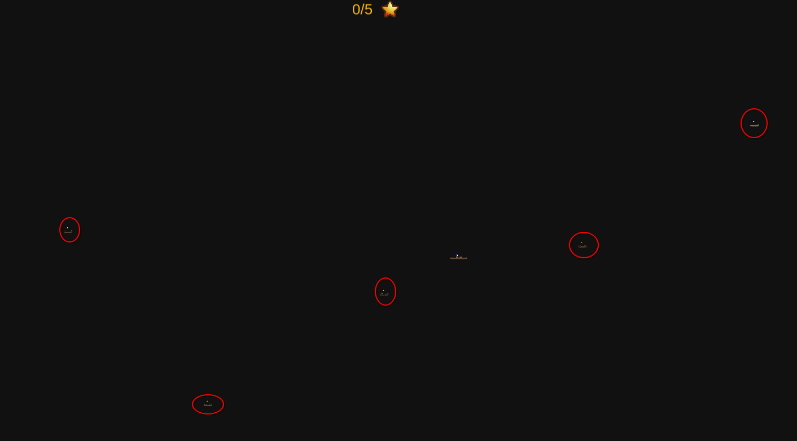

# Jumpy Jumper 1 & 2

C'est un challenge de reverse de game hacking.

Le jeu est un jeu de plateforme qui se joue dans le navigateur et qui consiste a obtenir toutes les étoiles pour obtenir les flags.
Il est composé de 2 parties, les 2 cartes du jeu.

## Description (part 1)


Un nouveau jeu viral est apparu sur le net ! Vous controllez un petit lapin rose et le but est de récuperer toutes les étoiles. Bon courage !

## Solution (part 1)

Le jeu est composé de 2 modules : le client & le serveur.

Le serveur connait le flag et compte les étoiles que le joueur récolte puis envoie le flag lorsque toutes les étoiles ont été récoltées.

Les deux modules communiquent en websocket avec la lib `socket.io`.

Toutes la physique est calculée côté client et le client envoie sa position très régulièrement pour que le serveur sache si il a récupéré une étoile.

A chaque positions reçues, le serveur calcule la vitesse du joueur, si elle est trop élevé c'est que le joueur s'est téléporté. Dans ce cas, le serveur oblige le client à revenir à la position précédente.

Il est donc possible de tricher en réduisant la gravité, en activant le double saut ou en augmentant la puissance des sauts.

Et finalement, le code JS est "légèrement" obfusqué pour que ce soit pas trop simple ^^

### Etape 1 : trouver le code du jeu

Dans l'onglet "Sources" de chrome, on a accès à la liste des EventListeners globaux.

La première entrée de l'événement keydown, nous amène au code du jeu qui gère les touches.


```js
const f = new Sf(h,c), p = new Set;
addEventListener(s(390), y => {
    const x = s;
    p[x(373)](y[x(423)])
}),
addEventListener(s(428), y => {
    p[s(411)](y.key)
}),
// ...
e.ticker[s(373)](y => {
    const x = s;
    l && f.update(y.deltaTime, p),
    o[x(382)](f[x(386)])
}
```

Après désobfuscation manuelle :

```js
const joueur = new Sf(h,c)
const touches_actives = new Set();
addEventListener("keydown", event => {
    touches_actives.add(event.key)
})
addEventListener("keyup", event => {
    touches_actives.delete(event.key)
})
// ...
e.ticker.add(timer => {
    const x = s;
    // le joueur est mis à jours avec les touches actives
    l && joueur.update(timer.deltaTime, touches_actives),
    o[x(382)](f[x(386)])
}
```

### Etape 2 : réduire la gravité

```js
// ...
h && (this[i(338)].y = Math[i(350)](this[i(338)].y, a + 1),
this[i(334)] < 0 && (this[i(334)] = 0)),
this[i(338)].y += this[i(334)] * t,
this[i(334)] += Cf, // Cf est la gravité (ajouté a chaque instant)
// ...
```

Avec la feature "Local overrides" de Chrome, réduire la gravité du joueur :

https://developer.chrome.com/docs/devtools/overrides

```js
// ...
h && (this[i(338)].y = Math[i(350)](this[i(338)].y, a + 1),
this[i(334)] < 0 && (this[i(334)] = 0)),
this[i(338)].y += this[i(334)] * t * 0.1,
this[i(334)] += Cf * 0.2, // patch du JS ici
// ...
```

En récupérant toutes les étoiles, on obtiens le flag

## Description (part 2)


C'était un peu simple non :) ? Un deuxième niveau est apparu ! 

## Solution (part 2)

Sur la deuxième carte, on spawn sur une île flottant mais aucunes étoiles en vue :(

Pour résoudre cette partie, il fallait se pencher sur les échanges réseaux entre le client et le serveur.


La carte est découpé en chunk, et le serveur n'envoie au client que les chunks qui sont autours de lui.

Malheureusement, il n'y a pas de chunk avec des étoiles autour du spawn. Il faut trouver un moyen de forcer le serveur à nous envoyer des chunks.


En utilisant la molette de la souris dans le jeu, la caméra zoom sur le joueur et un paquet est un envoyé avec la nouvelle valeur de zoom.

En jouant avec les valeurs envoyées, on se rends compte que le serveur utilise la valeur du zoom pour envoyer plus ou moins de chunks autour du joueur (les chunks visible).

```js
addEventListener("wheel", y => {
    const x = s;
    y[x(374)] < 0 ? o[x(371)] = o[x(371)] * 1.2 : o[x(371)] = o[x(371)] * .8,
    o.cam_scale < n && (o[x(371)] = n),
    o.cam_scale > a && (o[x(371)] = a),
    t[x(378)]("zoom", e.screen[x(415)] / o[x(371)]),
    o[x(382)](f.position)
}
```

Dans le client le zoom maximum est bloqué mais en débridant le zoom, on obtiens un aperçu de la carte entière.



En combinant avec la technique de la partie 1, on peut récuperer toutes les étoiles.
